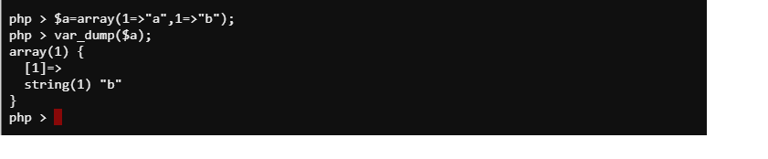

## Fast Destruct
# Xét trường hợp sau
```
<?php
class exploit_me
{
    public $cmd;
    public function __destruct(){
        system($this->cmd);
    }
}
$ex=$_GET['ex'];
$a= unserialize($ex);
throw new Exception("ga");
```
# Phân tích
  Như thường lệ, mỗi khi obj được khởi tạo và nếu không có gì xảy ra, nó sẽ bị hủy ở cuối chương trình, nhưng nếu ta muốn gọi hàm hủy ngay sau lệnh gọi unserialize thì sao? 
  đó là vấn đề ta sẽ tìm hiểu ngay sau đây.
  ở case trên, ta thấy sau khi unserialize thì chương trình sẽ ném ra một exception khiến chương trình không thể gọi hàm destruct khi kết thúc mã, vậy làm thế nào để ta bắt 
  nó hủy ngay sau khi unserialize? cách làm như vậy được gọi là Fast destruct 
  ở đây có một thư viện để làm điều đó, tham khảo tại
  https://github.com/ambionics/phpggc
  
 * phân tích case hiện tại
   ** chương trình có một class là exploit_me có thể thực hiện RCE nếu ra kiểm soát được cmd, vậy làm thế nào để RCE, ta hay xem một ví dụ sau
   
   
   
   tạo một array chứa 2 phần tử có chung key, ngay lập tức khóa đầu tiên bị hủy , vậy chúng ta cũng cần hủy gấp nên sẽ tạo 1 array để chứa 2 phần tử có chung key
   
    
   
   ở trên sử dụng payload 
   `a:2:{i:1;O:10:"exploit_me":1:{s:3:"cmd";s:2:"ls";}i:1;i:2;`
   là một array có 2 phẩn tử nhưng cả 2 đều có chung key, nên phần tử đầu tiên sẽ bị hủy, ngay lập tức ta có RCE mà không cần chờ tới cuối chương trình
   ** cách 2
   
   
   
   sử dụng payload 
   `O:10:"exploit_me":2:{s:3:"cmd";s:2:"ls";}`
   sau khi unserialize thì chương trình nhận thấy exploit_me chỉ có 1 thuộc tính, nhưng lúc mình truyền vào thì lại 2 dẫn tới hủy ngay lập tức, payload này có thể sử dụng để bypass __wakeup method
